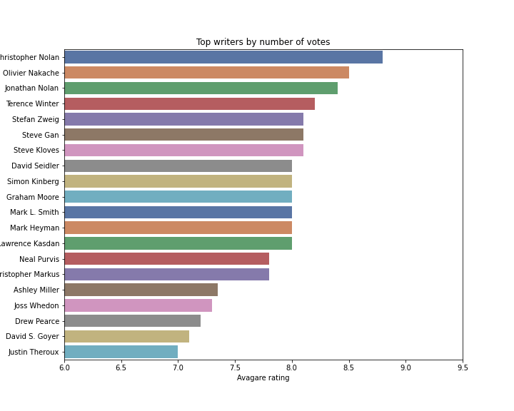
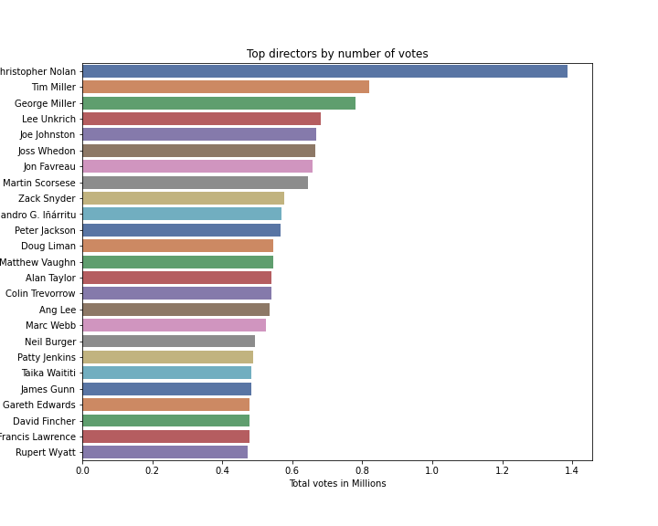
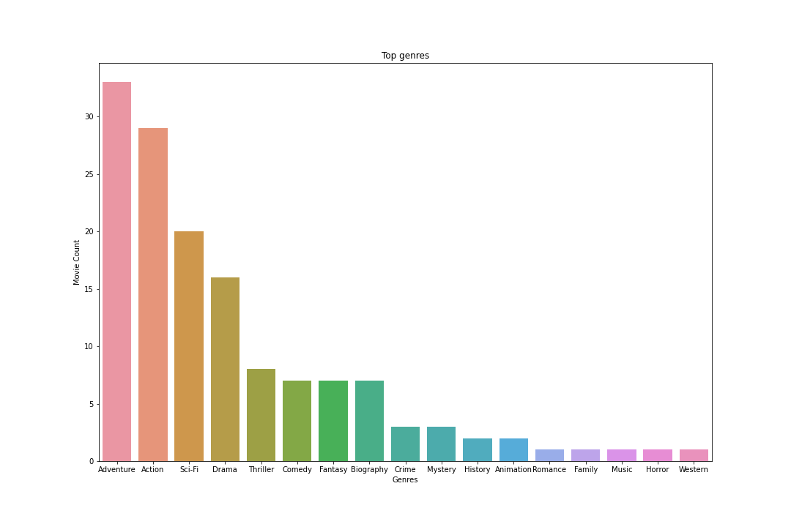
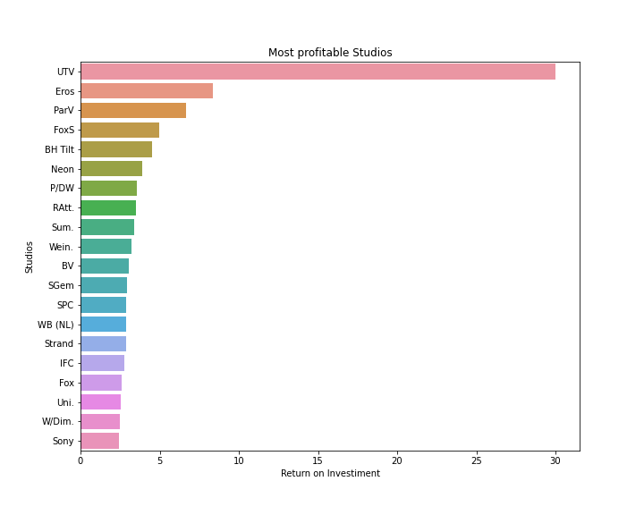

# 1. Movie Analysis for Microsoft

In this repository I will present analysis with recommendations to Microsoftf for their new movie production.

Sources:
 - Box Office Mojo
 - IMdB
 - Rotten Tomatoes
 - theMovieDB 
 - The Numbers

 
Using python, I will work with several csv files which could be found in the 'zipped_data' folder.

# 2. Business Problem

To advise Microsoft in how best to enter the movie production business. I will base my recommendations on analysis on movie data from movies up through 2018. I will understand and analyze, popular genres, the most profitable studios, the most popular directors and writers to better inform my recommendations. 

# 3. Data

The data used on this project was present from various sources and provided by Flatiron School. From those data I am able to analyze movies by titles, ratings, producers, studios, writers.

# 4. Results 

#### 1 - Christopher Nolan is the most popular writer by number of votes 

#### 2- Christopher Nolan is the most popular director by number of votes based on the median

#### 3 - Advanture-Action is the most popular genre by rating 

#### 3 - UTV is the most profitable studio based on return on investment.

# Summary

#### I conducted exploratory data analysis on several movie database datasets to provide recommendations to Microsoft on how best to enter the movie production business.

- I make recommendations on which:
- Writers and directors to work with,
- Popular movie genres to focus on,
- Movie studios to work with based on popularity or overall profitability.

